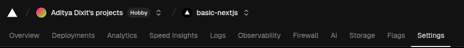
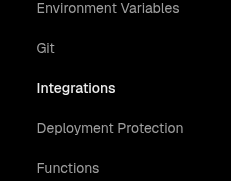

# Vercel Integrations

## Personal Choice of integrations

- NeonDB
- Clerk Auth
- Vercel Blob storage
- [Read More on Vercel Integrations](https://vercel.com/docs/integrations)

## Neon DB Integration

- In the vercel dashboard, select the project then goto settings
  
- On the left side bar select Integrations
  
- Browse marketplace and create integration
- You should see the integration in the storage tab
- Connect to the integration and update `.env` file accordingly

## [Clerk NextJS Quickstart](https://clerk.com/docs/nextjs/getting-started/quickstart)

- [Sign into Clerk Dashboard](https://dashboard.clerk.com/apps) and create application
- install `@clerk/nextjs` - `npm install @clerk/nextjs`
- Set Clerk API keys
- Update middleware in `proxy.ts` for Next16 and `middleware.ts` in Next15
- Wrap the html section in `src/app/layout.tsx` with the `<ClerkProvider>`
- Enable [Role Based Access Control](https://clerk.com/docs/guides/secure/basic-rbac)

```tsx
  return (
    <ClerkProvider>
      <html>
      .....
      </html>
    </ClerkProvider>
```

## [Sync Clerk data using webhooks](https://clerk.com/docs/guides/development/webhooks/syncing)
